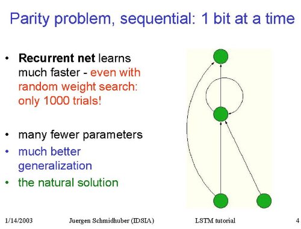

Learning to count number of 1s in a sequence of 0s and 1s
================================================================

This problem was mentioned by *J. Schmidhuber* in his `LSTM tutorial
<http://people.idsia.ch/~juergen/lstm>`_ as the **Parity problem**.

The task is quite simple: given a sequence like this  **00100001001**,
the network should classify whether number of **1s** in the sequence is odd
or even.

For example::

    00100111100 -> 1 (5 ones - odd)

    10001 -> 0 (2 ones - even)

This problem can be solved with a regular feedforward network, but using RNN
is much more natural and efficient solution.

Running this example
--------------------------

Go into the REPO root directory (i.e. into the folder that *contains* the
``parity_problem`` directory) and run this module as follows::

    python -m parity_problem

or adjust some parameters::

   python -m parity_problem --max-seq-length 100 --lstm-dim 1 \
   --batch-size 10 --num-batches 1000 --num-epochs 30

Structure of the Data
--------------------------

This example constructs a datastream on-the-fly, rather than
reading from disk. Training dataset consists of sequences of different length
from 1 to ``max_seq_length``. Each batch contains sequences of equal length and
its shape is ``(T, B, F=1)``

Structure of the Model
--------------------------

The model consists of a single ``LSTM`` layer with default ``Tanh``
activations, followed by a ``Linear`` classification layer with ``Logistic``
non-linearity. Cool stuff is that ``LSTM`` layer can contain as little as one
hidden unit and still handle sequences of arbitrary length.

Structure of the Training
--------------------------

The network learns from training examples using ``GradientDescent`` with
``Adam`` step rule. Number of of training batches and batch size can be
specified as command arguments. With default settings the network usually
converges in 20-30 epochs.

Structure of the Testing
--------------------------

The network is periodically tested on a separate test dataset and ``test_cost``
is printed after each epoch. Though having very small number of parameters the
network doesn't overfit and ``test_cost`` is almost equal to the
``train_cost``.
