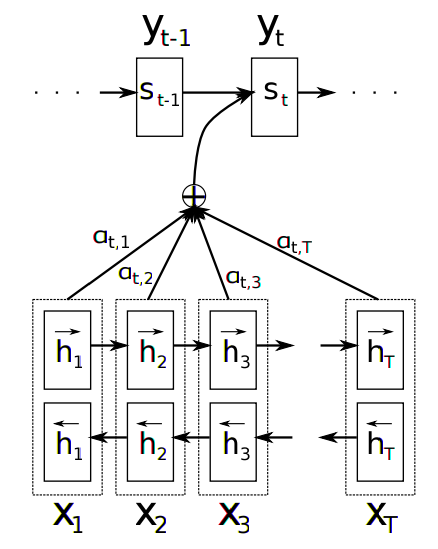

Learn to reverse the letters of each individual word in a text
================================================================

In this demo, a recurrent network equipped with an attention mechanism
learns to reverse each word (on a character-by-character basis) in its input text. 

The default training data is the Google Billion Word corpus, 
which you should download and put to the path indicated in your .fuelrc file.

* http://blocks.readthedocs.org/en/latest/
* http://fuel.readthedocs.org/en/latest/ is practically empty, better to look 
  at the source : https://github.com/mila-udem/fuel

As an example, the first sentence should be transformed into the second:

* ``The quick brown fox jumps over the lazy dog.`` 
* ... model ...
* ``eht kciuq nworb xof spmuj revo eht yzal god.`` 

The bulk of the functionality of the code is in the ``__init__.py`` file.

Overall, the model described seems to be as in the paper by Dzmitry Bahdanau, Kyunghyun Cho, Yoshua Bengio (2014) :

   Figure 1 of `Neural Machine Translation by Jointly Learning to Align and Translate <http://arxiv.org/abs/1409.0473>`_

Structure of the Data
--------------------------

The input data arrives through the a ``fuel`` data processing pipeline,
and the first section of the code deals with functions that clean and prepare the
data :

* converting character codes to and from a numerical (integer) encoding 
* a 'gold standard' reverse_words function that performs the task perfectly
* ``_lower`` and ``_filter_long`` data-cleaning functions that ensure that the 
  pipeline produces one lower-case character array for each input sentence,
  and that sentences of over 100 characters are filtered out
* ``_transpose`` is a convenience function to re-orient the matrices finally coming out of the data stream
* ``_is_nan`` is a termination function for training - not data processing

These functions live at the top level of the module, so that the model
can be cleanly pickled and unpickled.

Once the data is read in character-wise (``level="character"``), it
is cleaned up and converted into mini-batches using ``Batch`` with 
``iteration_scheme=ConstantScheme(10)``, which means that it works on 10 
sentences simulataneously.  

Each batch of sentences has ``Padding`` applied
that pads it out to the same length and simultaneously creates ``features_mask`` 
and ``targets_mask`` overlays that identify which of the data stream's output cells 
are filled with valid data.  We know that the sentences in each ``Batch`` are 
less that 100 characters long, however the ``Padding`` only expands the 
underlying data to be the size of the longest entry.

Structure of the Model
--------------------------

``class WordReverser`` is initialized with :

* ``dimension`` which refers to the size of the hidden size of the internal state-to-state data
* ``alphabet_size`` which allows the initial vector embedding (via ``LookupTable``) of characters into 
  a ``dimension`` dimensional vector (so that ``dimension`` is doing double-duty as the
  size of the internal recurrence, and the size of the vector embedding)

The model itself is ``Bidirectional``, with ``SimpleRecurrent`` units.  This means
that the model will contain two chains of SimpleRecurrent units, going forwards and
backwards along the sequence of characters in the sentence.

At each time-step on the ``encoder`` level (which corresponds to 
characters in the input stream) :

* the current character is mapped to an embedding vector
* the input has ``Fork`` applied, so that it can be fed via weights into 
  the different input paths of ``Birectectional/SimpleRecurrent`` units 
  (http://blocks.readthedocs.org/en/latest/api/bricks.html?highlight=fork#blocks.bricks.parallel.Fork)

Once the underlying ``Bidirectional/SimpleRecurrent`` unit states are calculated, 
a ``SequenceGenerator`` scans across them using an attention mechanism 
(``SequenceContentAttention``).  This ``SequenceGenerator`` contains another 
recurrent network (``transition``) that converts the ``encoder`` state into
an output sequence : 

* the attention mechanism calculates an alignment between the internal ``encoder`` 
  state and the previous output states
  (http://blocks.readthedocs.org/en/latest/api/bricks.html?highlight=sequencecontentattention#blocks.bricks.attention.SequenceContentAttention)
* the final output of the ``SequenceGenerator`` is read via a ``SoftmaxEmitter`` and converted to characters 
* and it feeds this result back to the ``transition`` recurrent level 
  via a ``LookupFeedback``

Structure of the Training
--------------------------

The training algorithm uses ``GradientDescent`` to create 
steps in the direction that reduces 
the mean over 
the batch of 
the sums of 
the log-likelihood costs associated with 
errors on the character outputs for 
each sentence.

The step-size is moderated first by ``StepClipping(10.0)``, 
which clips the gradient to have the norm of at most 10.0,
and then it has ``Scale(0.01)`` applied, 
which further scales down the clipped gradient.

Structure of the Testing
--------------------------

There are two modes available, which are defined within the ``generate(_input)`` 
local function definition: 

* ``beam_search`` which does a ``BeamSearch`` for the most likely output sequence, given an input sentence
* ``sample`` which instead produces a number of guesses at the output sentence

